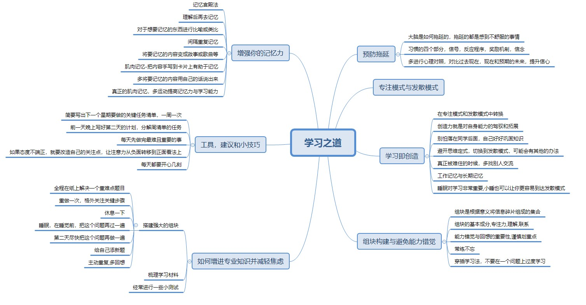

### 基本概念

+ 专注模式与发散模式
  专注模式是集中精力去做，发散模式则是思维非常跳跃，经常会有一些意想不到的灵感
+ 工作记忆
    在大脑中对正在处理的信息进行瞬时以及有意识加工的这部分记忆，理解为电脑内存
+ 长期记忆
    相当于记忆仓库，可以永久记忆，但是要经常调用出来，保持新鲜，理解为电脑硬盘
+ 习惯组成部分
    信号(触发),反应程序(执行事件),奖励程序(完成之后给自己激励),信念(相信自己可以完成)

### 学习方法

+ 间隔性重复有助于把信息从工作记忆转移到长期记忆
+ 单位时间内应该尽可能多地学习，一旦掌握了概念X,就应该将学习重心转移，过几天再 来复习概念x
+ 形成组块的基本成分：专注力，理解基本概念，练习
+ 在初读一本书的某个章节或某个部分，可以先宏观浏览一遍，将本章的标题，课后习题等扫一遍,但不用去做这些习题，可以加深理解

### 阻止拖延
#### 什么是拖延
    拖延症状,每次想到不怎么喜欢的事都会激活大脑中痛觉中枢，所以你就会逃到那些让你感觉开心的事情中去，获得暂时性的感觉良好
+ 心理对照法：经常拿自己想要的与现在的现状做对比，会激励你努力达到自己想要的状态，或者拿过往糟糕的状态与现在对比，你会发现坚持对你很有好处
+ 更多的关注过程，相对较少的关注结果。。。

###实践

+ 要有计划，每周需要周任务清单，每天晚上制定下一天的任务清单，任务完成的时间最好是截止到一个比较合适的时间，比如晚上九点左右，每天记得复盘当天学习和经历的内容，第二天早上起来之后再复习一遍
+ 形成组块，学习时先大概了解一下整章，然后利用专注模式进行学习，如果过程中遇到难以解决的问题，则可以转换到发散模式，多利用回想来加深记忆，让大脑提取关键概念，而非通过重复阅读被动地获取知识
+ 重复记忆，了解记忆曲线，将工作记忆变成长期记忆
+ 谨慎划重点，划重点的动作会让你欺骗你的大脑以为在工作，其实只是手在动而已，应该在自己理解了之后再进行重点的划分
+ 通过方法阻止拖延
+ 多运动来提升学习能力以及记忆力

